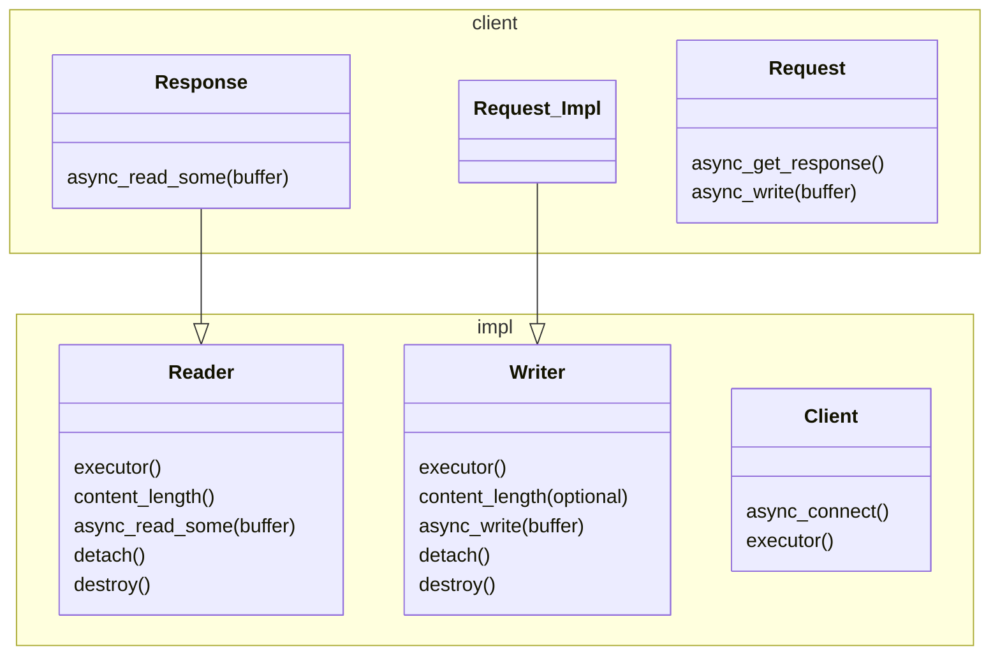

# Overview
Low-level C++ HTTP client and server library, based on ASIO.

** THIS REPOSITORY IS PURELY EXPERIMENTAL **

It supports HTTP/1.x, HTTP/2 and HTTP/3 behind a common, type-erasing interface, hence the *any* int the name.

None of those protocols are implemented from scratch. Instead, it is a wrapper around the following well-established libraries:

* Boost Beast
* nghttp2
* nghttp3 - not done yet.

## Synopsis

```C++
awaitable<void> echo(server::Request request, server::Response response)
{
   if (request.content_length())
      response.content_length(request.content_length().value());

   co_await response.async_submit(200, {}, deferred);

   std::array<uint8_t, 64 * 1024> buffer;
   for (;;)
   {
      size_t n = co_await request.async_read_some(asio::buffer(buffer), deferred);
      co_await response.async_write(asio::buffer(buffer, n), deferred);
      if (n == 0)
         break;
   }
}
```

# Implementation

The asynchronous operations exposed by server and client are [ASIO asynchronous operations](https://think-async.com/Asio/asio-1.30.2/doc/asio/reference/asynchronous_operations.html). As such, they support a range of [completion tokens](https://think-async.com/Asio/asio-1.30.2/doc/asio/overview/model/completion_tokens.html) like [use_awaitable](https://think-async.com/Asio/asio-1.30.2/doc/asio/reference/use_awaitable.html) or plain callbacks.

The implementation is hidden behind [any_completion_handler](https://www.boost.org/doc/libs/1_86_0/doc/html/boost_asio/reference/any_completion_handler.html) so that it can be compiled separately.


This work is partly inspired by [asio-grpc](https://github.com/Tradias/asio-grpc), which takes the idea even one step further and also supports the upcoming sender/receiver model of execution.




## Links

For now, this section contains just a set of random links collected during development.

* [Beast Example using Type Erasure](https://www.boost.org/doc/libs/develop/boost/beast/http/message_generator.hpp)
* [asio-grpc](https://github.com/Tradias/asio-grpc)
