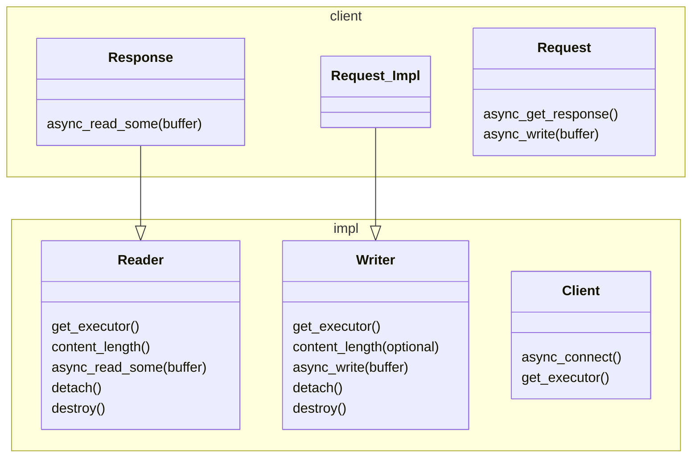

# Overview
[](https://github.com/pgit/anyhttp/actions/workflows/release.yml)
[](https://pgit.github.io/anyhttp/coverage/)

Low-level C++ HTTP client and server library, based on ASIO and its asynchronous model.

** THIS REPOSITORY IS PURELY EXPERIMENTAL **

It supports HTTP/1.x, HTTP/2 and HTTP/3 behind a common, type-erasing interface, hence the *any* int the name.

None of those protocols are implemented from scratch. Instead, it is a wrapper around the following well-established libraries:

* Boost Beast
* nghttp2
* nghttp3 - not done yet.

## Synopsis
### Server
```C++
Awaitable<void> echo(server::Request request, server::Response response)
{
   if (request.content_length())
      response.content_length(request.content_length().value());

   co_await response.async_submit(200, {});

   std::array<uint8_t, 64 * 1024> buffer;
   for (;;)
   {
      size_t n = co_await request.async_read_some(asio::buffer(buffer));
      co_await response.async_write(asio::buffer(buffer, n));
      if (n == 0)
         break;
   }
}
```
### Client
```c++
Awaitable<void> do_session(Client& client, boost::urls::url url)
{
   auto session = co_await client.async_connect();
   auto request = co_await session.async_submit(url, {});
   auto response = co_await request.async_get_response();   
}
```
# Implementation

The asynchronous operations exposed by server and client are [ASIO asynchronous operations](https://think-async.com/Asio/asio-1.30.2/doc/asio/reference/asynchronous_operations.html). As such, they support a range of [completion tokens](https://think-async.com/Asio/asio-1.30.2/doc/asio/overview/model/completion_tokens.html) like [use_awaitable](https://think-async.com/Asio/asio-1.30.2/doc/asio/reference/use_awaitable.html) or plain callbacks.

The implementation is hidden behind [any_completion_handler](https://www.boost.org/doc/libs/1_86_0/doc/html/boost_asio/reference/any_completion_handler.html) so that it can be compiled separately.


This work is partly inspired by [asio-grpc](https://github.com/Tradias/asio-grpc), which takes the idea even one step further and also supports the upcoming sender/receiver model of execution.

## Capy + Corosio Coroutine Support

The library provides parallel C++20 coroutine APIs for both client and server using the Capy coroutine primitives library and Corosio for actual network I/O.

### Enable Capy Support

Configure with the `ANYHTTP_ENABLE_CAPY` option:

```bash
cmake -S . -B build -G Ninja -DCMAKE_BUILD_TYPE=RelWithDebInfo -DANYHTTP_ENABLE_CAPY=ON
cmake --build build --parallel
```

### API Overview

When `ANYHTTP_ENABLE_CAPY=ON`, all major I/O operations support Capy-based coroutines:

#### Server Request & Response
```cpp
// Server Request (read from client)
auto [ec, bytes_read] = co_await request.async_read_some_capy(buffer);

// Server Response (write to client)
auto [ec] = co_await response.async_submit_capy(200, headers);
auto [ec] = co_await response.async_write_capy(buffer);
auto [ec] = co_await response.async_write_eof_capy();
```

#### Client Response & Request
```cpp
// Client Response (read from server)
auto [ec, bytes_read] = co_await response.async_read_some_capy(buffer);

// Client Request (send to server)
auto [ec, response] = co_await request.async_get_response_capy();
auto [ec] = co_await request.async_write_capy(buffer);

// Client connection
auto [ec, session] = co_await client.async_connect_capy(endpoint);
```

### Key Design Points

- **Parallel, not Replacement**: Capy methods coexist with traditional Asio completion-token APIs
- **Structured Binding**: All Capy operations return `io_result<T>` compatible with structured bindings
- **Lifetime Safety**: Awaitable state uses `shared_ptr` to prevent use-after-free on cancellation
- **Cancellation Support**: Via `env->stop_token` checks in `resume_result()`

### Minimal Example

Run the TCP loopback example:

```bash
build/src/capy_corosio_minimal
```

The example source is in `src/capy_corosio_minimal_main.cpp` and demonstrates:

* a Corosio `tcp_acceptor` and `tcp_socket` with Capy tasks
* `capy::run_async` launching multiple concurrent tasks
* Structured binding of `io_result<>` for error handling
* Real network I/O (not just coroutine primitives)

### Testing

Run the test suite with Capy tests:

```bash
build/test/test_all --gtest_filter="Capy*"
```

### Implementation Architecture

The implementation bridges Capy coroutine primitives to the existing AnyHTTP async infrastructure:


```mermaid
classDiagram

Response --|> Reader
Request_Impl --|> Writer

namespace client {
   class Response {
      async_read_some(buffer)
   }
   class Request {
      async_get_response()
      async_write(buffer)
   }
   class Client {
      async_connect()
   }

   class Request_Impl {

   }
}

namespace impl {
   class Reader {
      get_executor()
      content_length()
      async_read_some(buffer)
      detach()
      destroy()
   }
   class Writer {
      get_executor()
      content_length(optional<size_t>)
      async_write(buffer)
      detach()
      destroy()
   }
   class Client {
      get_executor()
   }
}
```


## Links

For now, this section contains just a set of random links collected during development.

* [Beast Example using Type Erasure](https://www.boost.org/doc/libs/develop/boost/beast/http/message_generator.hpp)
* [asio-grpc](https://github.com/Tradias/asio-grpc)
