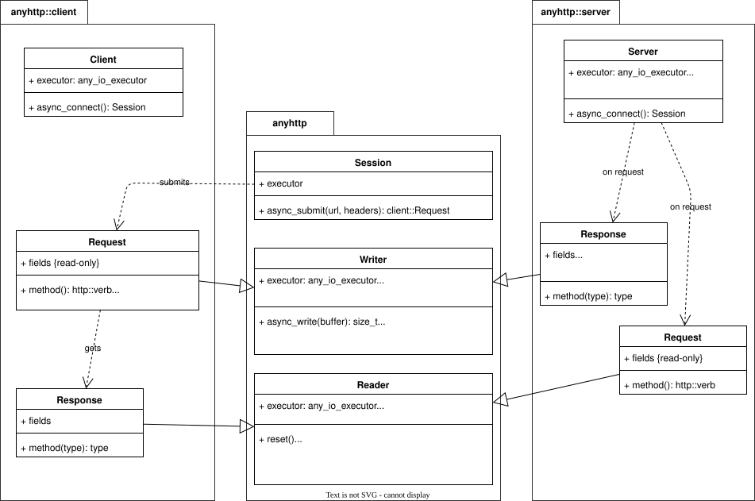

# Overview
[](https://github.com/pgit/anyhttp/actions/workflows/release.yml)
[](https://pgit.github.io/anyhttp/coverage/)

Low-level C++ HTTP client and server library, based on ASIO and its asynchronous model.

** THIS REPOSITORY IS PURELY EXPERIMENTAL **

It supports HTTP/1.x, HTTP/2 and HTTP/3 behind a common, type-erasing interface, hence the *any* int the name.

None of those protocols are implemented from scratch. Instead, it is a wrapper around the following well-established libraries:

* Boost Beast
* nghttp2
* ngtcp2/nghttp3

## Synopsis
### Server
```C++
awaitable<void> echo(server::Request request, server::Response response)
{
   if (request.content_length())
      response.content_length(request.content_length().value());

   co_await response.async_submit(200, {});

   std::array<uint8_t, 64 * 1024> buffer;
   for (;;)
   {
      auto [ec, n] = co_await request.async_read_some(asio::buffer(buffer), as_tuple);
      if (ec == asio::error::eof)
         break;
      if (ec)
         throw boost::system::system_error(ec);

      co_await response.async_write(asio::buffer(buffer, n));
   }

   co_await response.async_write_eof();
}
```

The end of an incoming body is reported the way ASIO reports it everywhere else: `asio::error::eof`
with zero bytes. A body cut short -- a reset stream, a connection that went away mid-message --
completes with `http::error::partial_message` instead, so the two stay distinguishable.

The end of an *outgoing* body is stated explicitly, with `async_write_eof()`. It takes a buffer of
its own, so the last of the body and the end of it go out together -- one DATA frame with
END_STREAM, one QUIC STREAM frame with FIN, one last chunk -- instead of costing a second, empty
write:

```C++
   co_await response.async_submit(200, fields({{"Content-Length", body.size()}}));
   co_await response.async_write_eof(asio::buffer(body));
```
### Client
```c++
awaitable<void> do_session(Client& client, boost::urls::url url)
{
   auto session = co_await client.async_connect();
   auto request = co_await session.async_submit(url, {});
   auto response = co_await request.async_get_response();   
}
```

A plain GET needs none of those four steps spelled out. `async_get()` does the whole request as one
operation and hands back the response as a plain Beast message -- status, fields and the body as a
`std::string`:

```c++
   auto session = co_await client.async_connect();
   auto message = co_await session.async_get(url);
   std::println("{}: {} bytes", message.result_int(), message.body().size());
```

The convenience is paid for with memory, as the body is buffered in full: anything that wants to
look at the body while it arrives, or to send a body of its own, still goes through
`async_submit()`.

# Class Hierarchy



# Implementation

The asynchronous operations exposed by server and client are [ASIO asynchronous operations](https://think-async.com/Asio/asio-1.30.2/doc/asio/reference/asynchronous_operations.html). As such, they support a range of [completion tokens](https://think-async.com/Asio/asio-1.30.2/doc/asio/overview/model/completion_tokens.html) like [use_awaitable](https://think-async.com/Asio/asio-1.30.2/doc/asio/reference/use_awaitable.html) or plain callbacks.

The implementation is hidden behind [any_completion_handler](https://www.boost.org/doc/libs/1_86_0/doc/html/boost_asio/reference/any_completion_handler.html) so that it can be compiled separately.

This work is partly inspired by [asio-grpc](https://github.com/Tradias/asio-grpc), which takes the idea even one step further and also supports the upcoming sender/receiver model of execution.


## Concurrent Requests

HTTP/2 and HTTP/3 multiplex requests: each one is a stream of its own, and streams make progress independently. HTTP/1.1 has a single connection instead, which requests are written to and responses read from, one after the other. anyhttp treats HTTP/1.1 as a protocol with **"max concurrent streams = 1"**, and makes that explicit in the client API instead of hiding it.

### Complete requests and responses

A request is *complete* when all of it -- header and body -- has been written to the connection:

* A request **without a body** is complete as soon as `async_submit()` has succeeded. Whether a request has a body is a matter of its framing only ([RFC 9112, section 6.3](https://www.rfc-editor.org/rfc/rfc9112#section-6.3)), never of its method: it has none without `Transfer-Encoding` and with a `Content-Length` of zero or none. As the HTTP/1.1 client sends every request without `Content-Length` chunked, that means `Content-Length: 0`.
* **Any other request** is complete when `async_write_eof()` has succeeded -- even if all of a `Content-Length` has been written before. The body of a request without one is ended implicitly: `async_write_eof()` is an idempotent no-op on it, and writing data fails with `broken_pipe`.

A response is *complete* when it has been read to its end.

### Rules for HTTP/1.1

1. `async_submit()` fails with `asio::error::would_block` while the previous request is not complete.
2. `async_get_response()` fails with `asio::error::would_block` while the responses to earlier requests have not been read completely -- otherwise, it would read one of those.
3. When a request can not be completed -- a write fails, or it is released before it is complete -- the connection is stuck in the middle of a message: every later `async_submit()` fails with `asio::error::connection_aborted`.
4. When a response can not be read completely -- it is released before its end, or its request is released without asking for it -- every later `async_get_response()` fails with `asio::error::connection_aborted`.

Pipelining is still possible: complete requests can be sent before any of their responses have been read.

### Design decisions

* **Fail instead of waiting.** An operation that has to wait for an earlier request or response does not wait. Very often, the caller waiting is the one who has to finish that earlier request or response, after the operation returns -- waiting would deadlock. Failing immediately with `would_block` turns a hang into an error that can be handled: finish the earlier one, then retry.
* **No queueing of submitted requests.** An earlier version queued the header of a request submitted while the previous one was still incomplete, and sent it as soon as that was complete. That allows code written for HTTP/2 -- submit a couple of requests first, write their bodies later -- to work unchanged. But it needed a queue of pending requests, writes waiting for a header still on its way (and not cancellable while doing so), and failures cascading to queued requests. Refusing the submission keeps it at a single incomplete request per session, which is exactly what the protocol allows.
* **Requests and responses may outlive their session.** The session keeps track of all of its readers and writers, and detaches them when it goes away. Everything a detached request or response is asked to do after that completes with an error (`connection_aborted` for HTTP/1.1 and HTTP/2, `connection_reset` for HTTP/3), without touching the connection that is gone.

### Outlook: HTTP/2 and HTTP/3

HTTP/2 and HTTP/3 have a limit of their own: the peer's `SETTINGS_MAX_CONCURRENT_STREAMS`, or the QUIC stream limit. With that limit reached, they should behave just like HTTP/1.1 -- fail with `would_block` instead of waiting. Currently, anyhttp does not check that limit itself, and leaves it to nghttp2 and ngtcp2; tests for that are still to be added.

One difference remains to be decided: in HTTP/2 and HTTP/3, a stream counts against the limit until it is closed in *both* directions, that is, until its response has been received as well. Taken strictly, "max concurrent streams = 1" would forbid submitting the next request before the previous response has been read -- which is stricter than HTTP/1.1 pipelining as implemented.

## Moving to HTTP/3: Alt-Svc

HTTP/3 runs on QUIC, and QUIC is not something a TCP connection can turn into: there is no
`Connection: Upgrade` on the way to HTTP/3, the way there is one from HTTP/1.1 to HTTP/2. What
there is instead is the server saying where else it can be reached
([RFC 7838](https://www.rfc-editor.org/rfc/rfc7838)), and the client making its *next* connection
there.

The server does that for its own HTTP/3 endpoint, which shares the address and port the TCP
acceptor is listening on, so the advertised alt-authority is a port and nothing else -- an empty
host in one means "the host of the origin":

```
Alt-Svc: h3=":8080"; ma=86400
```

It goes into every response sent over HTTP/1.1 and HTTP/2, but never over HTTP/3, which is already
there. `server::Config::alt_svc_max_age` is how long a client may remember it, and `0s` advertises
nothing at all.

A client only acts on it with `client::Config::follow_alt_svc` set, and then it takes precedence
over `client::Config::protocol`:

```c++
   client::Client client(executor, {.url = url, .protocol = Protocol::h2, .follow_alt_svc = true});

   auto first = co_await client.async_connect();  // HTTP/2, and learns about the alternative
   auto second = co_await client.async_connect(); // HTTP/3
```

The session that learns about the alternative keeps speaking what it speaks -- a connection in the
middle of a request can not be moved -- and the alternative is remembered for as long as `ma` says,
but only for the lifetime of the `Client`: there is no cache on disk. The origin does not change
with any of this, only where it is reached: requests still go out with the authority of
`Config::url`.

Over HTTP/2, an alternative may also arrive in an `ALTSVC` frame instead of a header field, which
lets a server advertise before the first request has even been sent. anyhttp's client reads both;
its server sends the header field only.

`curl` does the same thing, which is the easy way to watch it happen -- it honours `Alt-Svc` for
`https://` origins only, so this needs TLS, and a cache file to remember the alternative between
invocations:

```sh
./build/src/server -p 8080
```

```sh
curl --alt-svc altsvc.txt --cacert pki/out/root.pem https://localhost:8080/echo -d hello -so/dev/null -w '%{http_version}\n'
```

The first run answers `2`, and every one after it `3`.

## Links

For now, this section contains just a set of random links collected during development.

* [Beast Example using Type Erasure](https://www.boost.org/doc/libs/develop/boost/beast/http/message_generator.hpp)
* [asio-grpc](https://github.com/Tradias/asio-grpc)
